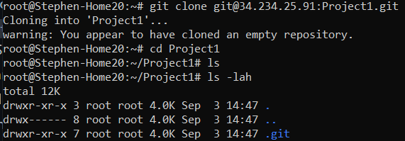

# CEG3120-Project 01

## Setup
### Create Initialize Git Repository
Command: git init --bare reponame.git

This will create a blank git repository with handling data transfer, but without an workspace

### Creating User Accounts

Command: sudo adduser pickname

This will create the user pickname as well as its home directory.

### Permissions
Each file and directories contains permissions that only allow certain users from accessing

To view permissions of subfolders and files, type ls -lah 

On the far left you see this,
-rwxrw-rw-

The first character is whether name is file(-) or directory (d)
Each group of three characters after that is an set revealing the permissions

- The first set is the owner's permissions of the file/directory.
-The second set is the permissions of the group
-The last set is the permissions of anyone who is not the owner or within its assigned group

A permissions can be changed using the chmod command. Only use sudo if it requires.

chmod sets permission based on a 3-digit number
3rd digit: Owner
2nd digit: Group
1st digit: Other

4 = read
2 = write
1 = execute
0 = none

You add the digits together, then you set it on the 3-digit number

### SSH Keys

SSH Keys are used to securely remote into systems

In the system you are connecting from, open an terminal
Type "ssh-keygen -t EncryptionType -C "email/computername""

t can be either rsa or ed25519

1. Path of file (Optional)
2. PassPhrase
3. Confirm PassPhrase

In either the path you specified or default is ~/.ssh/'Encryptiontype',
you copy the contents of the .pub file and paste it after typing ~/.ssh/authorized_keys file of the system you are connecting to.

Make sure the .ssh directory and the authorized_keys file is created by typing "mkdir ~/.ssh" and "vim authorized_keys"

## Git Usage
To run commands 2-4, you must be in the repository directory on the local system

1. First time download of the git repository

git clone git@34.234.25.91:Project1.git

2. Queueing a file/directory to git repository

git add file/directory

3. Confirming the file/directory queue with a message
git commit -a

You type a message explaining the reason(s) for the commit

4. Submit the git repository changes to the server
git push

Screenshot of 
