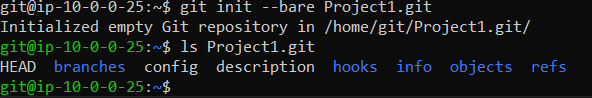

# CEG3120-Project 01

## Setup

### Creating User Accounts

    Command: sudo adduser pickname

    Create a password
    Enter user information (optional)
    This will create the user pickname as well as its home directory.

    To switch to the new user, you use su - pickname

### Create Initialize Git Repository
    Command: git init --bare reponame.git

    git init command will initialize the directory into an git repository with a workspace to immediately add files
    If you include the --bare command, this is used to create empty repository to be used remotely.
**Note** It is usually best to create the new repository in the home directory of the user using that repository.

### Permissions
    Each file and directories contains permissions that only allow certain users from accessing

    To view permissions of subfolders and files, type ls -lah 

    On the far left you see this,
    -rwxrw-rw-

    The first character is whether name is file(-) or directory (d)
    Each group of three characters after that is an set revealing the permissions

    - The first set is the owner's permissions of the file/directory.
    - The second set is the permissions of the group
    - The last set is the permissions of anyone who is not the owner or within its assigned group

    Permissions can be changed using the chmod command. Only use sudo if it requires.

    chmod sets permission based on a 3-digit number
    3rd digit: Owner's Permissions
    2nd digit: Group's Permissions
    1st digit: Other's Permissions

    4 = read
    2 = write
    1 = execute
    0 = No Permissions

    You add the digits together, then you set it on the 3-digit number

    Example: to set Bob who is the owner of a file to only read and write
        
        chmod 600 newfile.txt (4+2=6, read and write)

### SSH Keys

    SSH Keys are used to securely remote into systems

    In the system you are connecting from, open an terminal
    Type "ssh-keygen -t EncryptionType -C "email/computername""

    t can be either rsa or ed25519

    1. Path of file (Optional)
    2. PassPhrase
    3. Confirm PassPhrase

    In either the path you specified or default is ~/.ssh/'Encryptiontype', you copy the contents of the .pub file.
    In the remote system, you must be logged in as the user to be used in the clone command.
    Paste the public key content into ~/.ssh/authorized_keys file of the system you are connecting to.

   **Note** Make sure the .ssh directory and the authorized_keys file is created by typing "mkdir ~/.ssh" and "vim authorized_keys"

## Git Usage
    To run commands 2-4, you must be inside of the repository directory to be 

 1. First time download of the git repository

    git clone git@34.234.25.91:Project1.git

   **Note** If the git server was initialized using the --bare command, the clone command will automatically create a empty workspace for the local system to work in. Otherwise it will also download the files included in the workspace to the local system.

 2. Queueing a file/directory to git repository

    git add file/directory

    If file or directory is in a subdirectory, you must specify the path

 3. Confirming the file/directory queue with a message
    
    git commit -a

    The -a flag says any files that were not added to git, ignore

   **Note** You type a message explaining the reason(s) for the commit. Using text editor, the commit must be saved in order to proceed.

 4. Submit the git repository changes to the server
    
    git push

   **Note** If an issue occurs with this command, check the ssh keys to make sure the correct permissions are set and the correct keys are used

Screenshot of repository existing on system

Screenshot of cloning command on the local system

