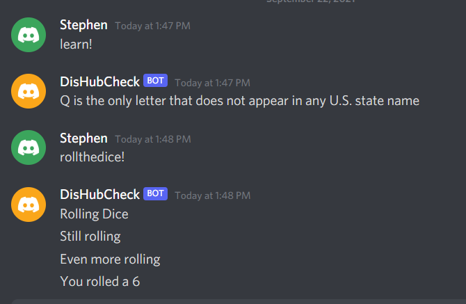

# Discord API

## Setup

### Getting an API

In order to get an API, you must have an account on the [Discord development portal](https://discord.com/developers/applications).

Select "New Application", enter name

Go over to the left menu, select Bot

Click "Add Bot", Select "Yes, do it"

Under Token, click "Copy"

### Put API Key in the code

In the same directory as the bot.py file, create an new file named .env

This file stores all the enviromental variables to be used in the bot file

Within the .env file insert this line: "DISCORD_TOKEN=your-bot-token"
also add "DISCORD_GUILD={your-server-name}"

If the bot.py does not exist, download the [Discord Bot](https://realpython.com/how-to-make-a-discord-bot-python/)

**Note** If using git/GitHub, make you create a .gitignore file and insert the .env file path to prevent accidentally upload of the confidential token

Back in the Developmental Portal, click OAuth2, tick the bot checkmark

Below, select the permissions for the given bot, copy the AuthenticationURL generated by Discord. 

Place this url in a browser, then select the server the bot will be a part of. A new server would have to be created if desired.

In order to enable the bot in Discord, type the command "python DisBot.py" or "python3 DisBot.py" in a terminal or command prompt.

The command will output that it is connected to Discord or it will output an error. From there the terminal does not have to be touched.

### Dependencies
You would need to install two python packages

1. Discord
2. dotenv

Install them by opening an terminal or command prompt and typing command

"pip install -U python-dotenv"

"pip install discord.py"

Alternatively, these commands can be used if more than one python version is installed

"pip3 install -U python-dotenv"

"pip3 install discord.py"

## Usage

### Commands

- learn!
- rolldice!

### Command Outputs

- learn! will output any random facts may or may not have been known
- rolldice! will institute an dice roll where it will randomize three times and will output the 4th randomized number

### ScreenShot of Commands

## Research

If you planning to run your discord bot 24/7 but do not want to use your personal computer. Here are some alternatives to work with

1. There are servers you can rent for very cheap like Digital Ocean,AWS,etc. that will provide you with an Linux distribution to work off of. The advantage of this method would be none of your personal network or power resources would be used to manage this service

2. A Rasberry Pi is another option running all day at your house and is very low maintenance. The advantage would be 

In either case, you would set the Discord bot file to be set up in the systemmd service that would run whenever system is booted up or restarted