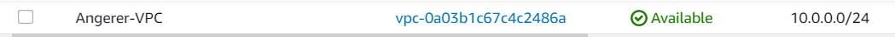
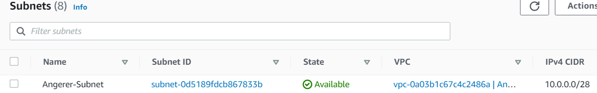
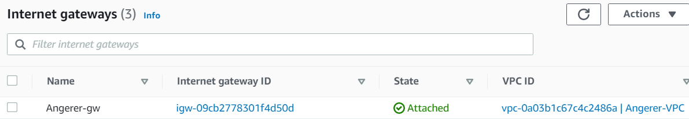
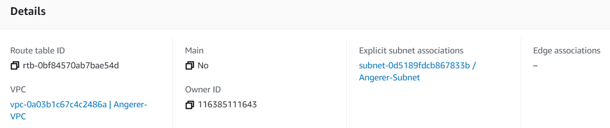
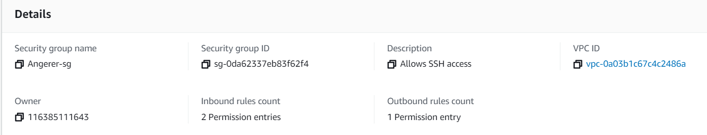

# Project 3

## VPC Creation

A Virtual Private Cloud (VPC) allows an aws instance to be run in an network created in the cloud

## Subnet Creation

Subnets specify the static and dynamic parts in a range of ip addresses that can be used in your VPC.

## Internet Gateway Creation

An Internet Gateway allows the VPC to access the Internet, to go out to the world

## Route Table Creation

The route table is like port forwarding in an router. It has a rules or routes that determine what traffic from gateway or subnet goes where

## Security Group Creation

Security Group is a firewall. It will only allow certain ip address and certain ports associated with those ip addresses.