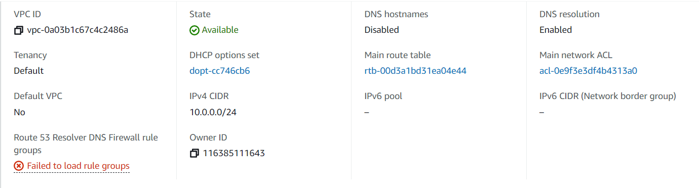
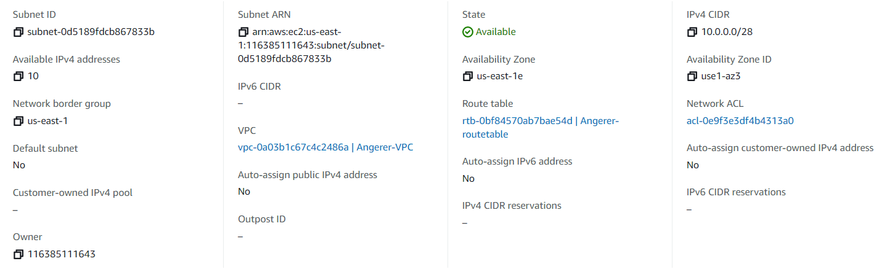
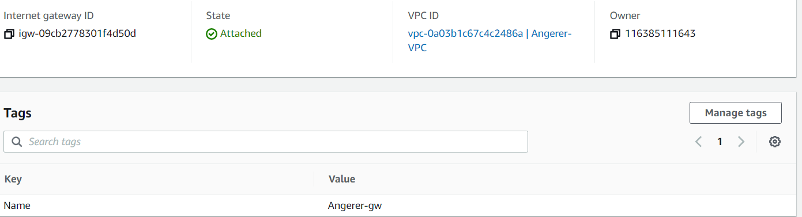
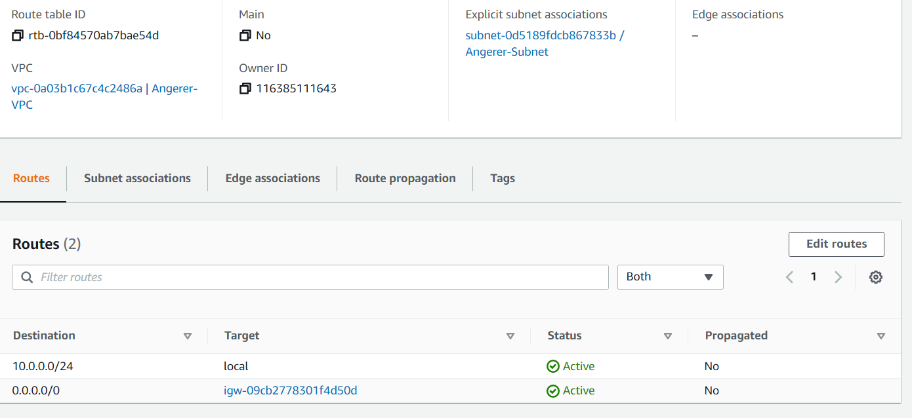
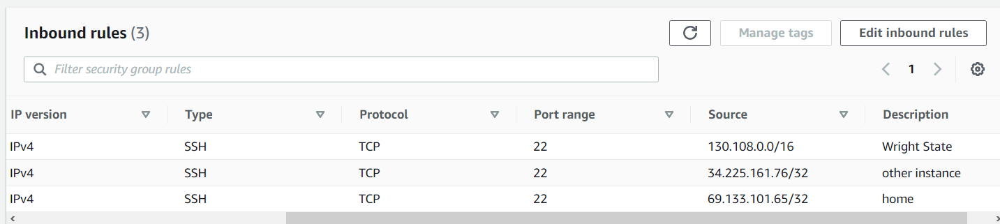
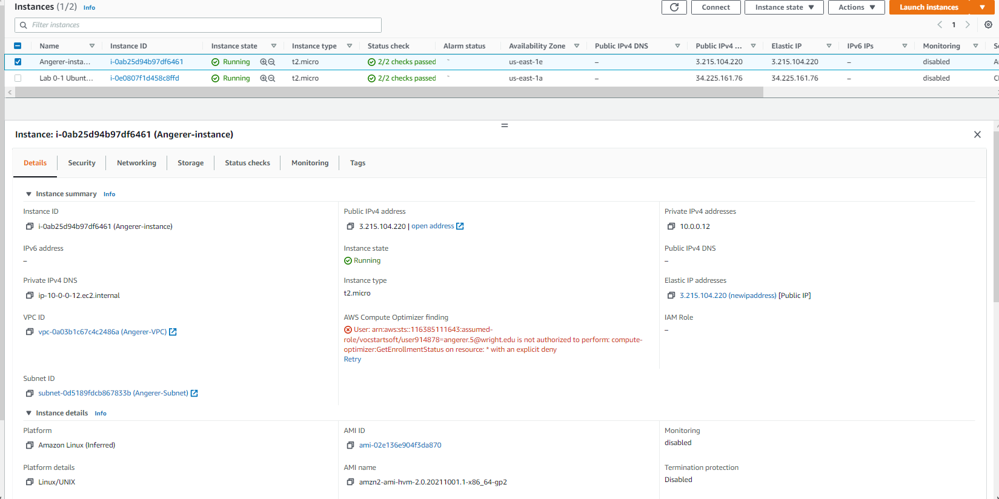
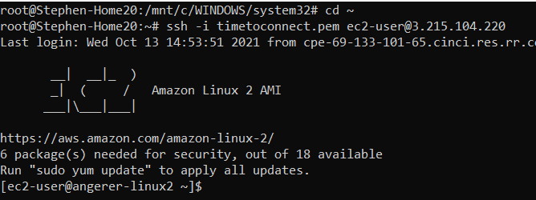

# Project 3

## Part 1
### VPC Creation

A Virtual Private Cloud (VPC) allows an aws instance to be run in an network created in the cloud

### Subnet Creation

Subnets specify the static and dynamic parts in a range of ip addresses that can be used in your VPC.

### Internet Gateway Creation

An Internet Gateway allows the VPC to access the Internet, to go out to the world

### Route Table Creation

The route table is like port forwarding in an router. It has a rules or routes that determine what traffic from gateway or subnet goes where

### Security Group Creation

Security Group is a firewall. It will only allow certain ip address and certain ports associated with those ip addresses.

## Part 2

AMI Selection: Amazon Linux 2 (x86)

Default User: ec2-user

Instance Type: t2.micro

Attaching Instance to VPC: In Instance Details, I went under network, click dropdown menu. I then selected my VPC, which included my lastname

Auto Assign IP Address: I disabled this setting because Amazon could use dynmaic IP addresses and could reset my public IP address at any moment, in which I would have to constantly log in to see the new IP address. We will be setting an static public IP address

Adding a volume: The root volume is automatically set but you can customize the volume space by typing in the number in the textbox. I just left it at 8GB. I also left the disk type at GP SSD 2. You may change it to another type, but there are costs

Adding Tags: I clicked the "Add Tag" button. In the "Key" textbox, I put "Name". I pressed the tab key and typed my "lastname-instance"

Configure Security Groups: I clicked the option under "Assign a security group", "Select existing group". It displayed a list of all security group ids. I simply selected the one I created with my lastname and verified the rules associated with it

Associate Elastic IP Address: On the side bar, I clicked Elastic IP address, clicked "Allocate Elastic IP Address. I left the Network Border Group as default of "us-east-1". I set a tag for the ip address

I selected the IP address, went to "Actions" and clicked "Associate Elastic IP Address". Left Resource Type to Instance. I chose the Lastname instance. I set a private Ip Address. Because this is the only ip address, I do not need to check reassociate ip address because I am not going to use it again.

### Instance Creation

### SSH Connection

