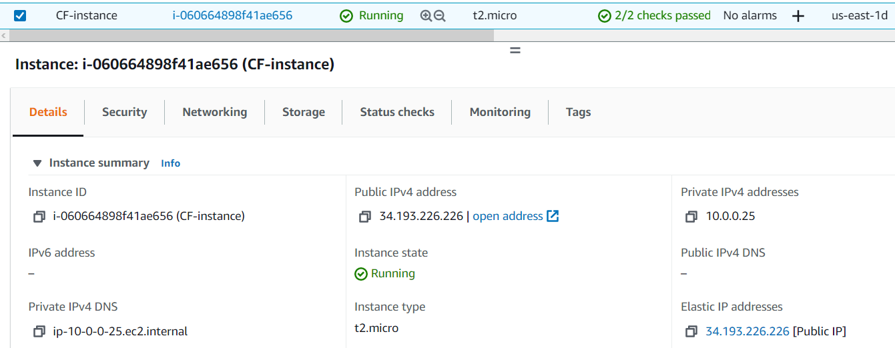
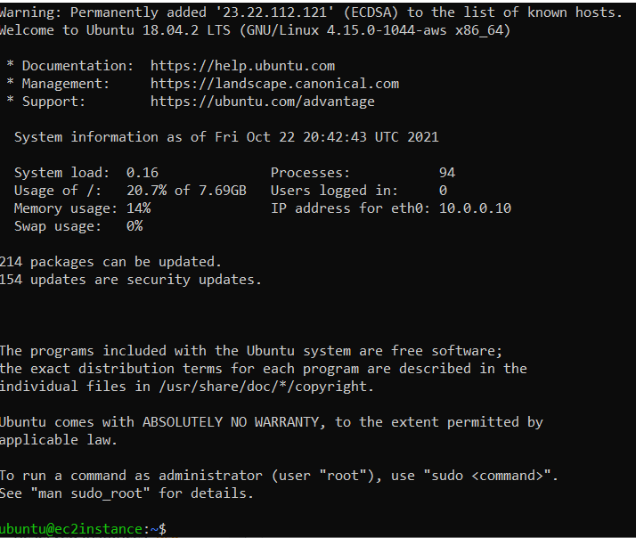

After adding the appropriate values and commands,
1. Loaded the template into the stack
2. Set the ssh key
3. Created the stack

I logged into the server with the "ssh -i" command

### Instance Creation

### Successful Login
