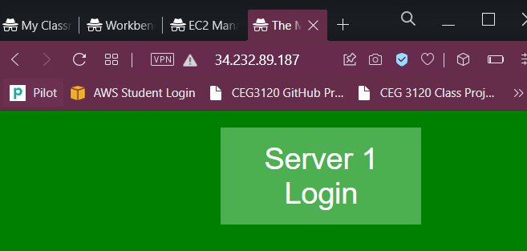
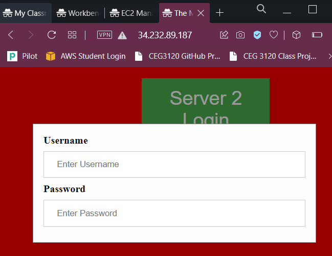

1. The /etc/hosts file is configured so that any private or public IPs can be attached to an custom hostname. Each hostname is set up with the ip of the remote system followed by the custom hostname. For example: "10.0.0.9 web1"
2. copy the private key from local system to the proxy server. Since the web servers have the same public ips, all need to type in proxy system is "ssh -i privatekey.pem ubuntu@web1". While web1 is configured in /etc/hosts as 10.0.0.9
3. 
    a. apt-get install -y haproxy
    b. The haproxy.cfg is the config file in /etc/haproxy folder
    
    c. The contents at end of file:
        frontend myfrontend
            mode http
            bind *:80
            default_backend backservers

        backend backservers
            mode http
            server s1 10.0.0.9:80
            server s2 10.0.0.10:80
    The frontend receives any input from port 80
    It will automatically switch between server 1 and server 2

    d. sudo systemctl restart haproxy.service
    e. apache2 was used for websites and php was used to code the page
4. 
    a. sudo apt-get install -y apache2
    b. The index.php webpage is configured in /var/www/html
    c. No configuration files were modified since port 80 was already enabled
    d. PHP and CSS were used. CSS was used to animate the login button

5. 
    Web Server 1

    

    Web Server 2

    